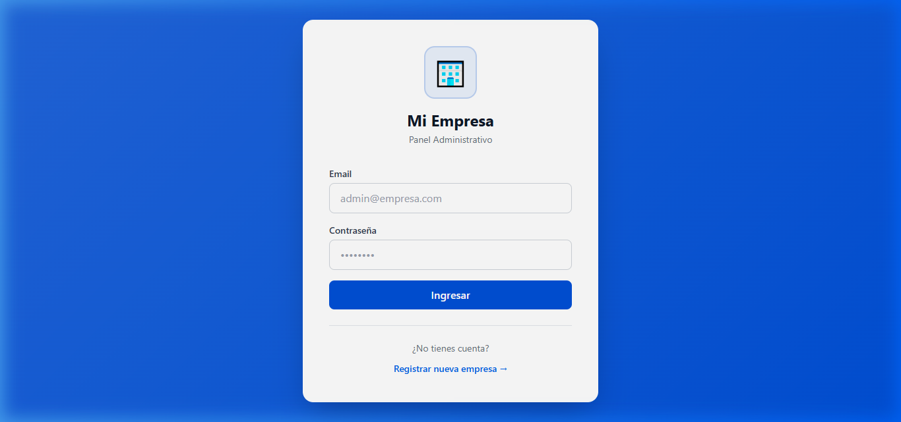
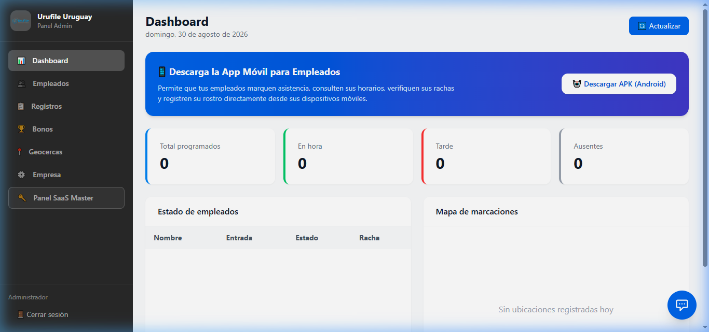
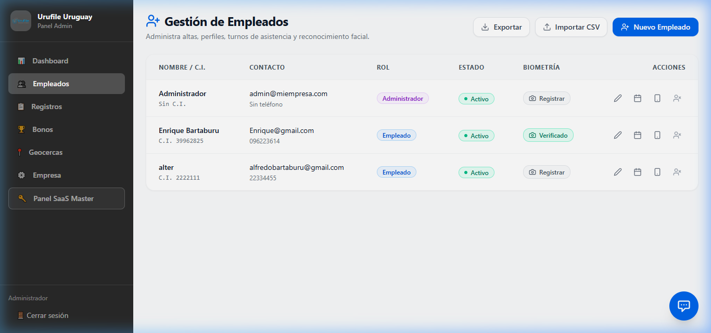
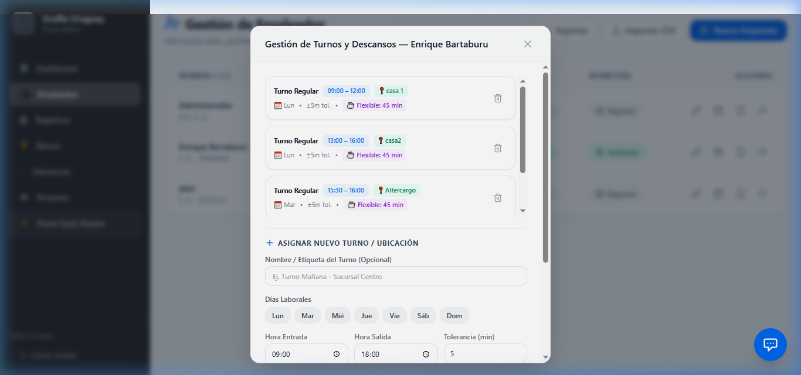
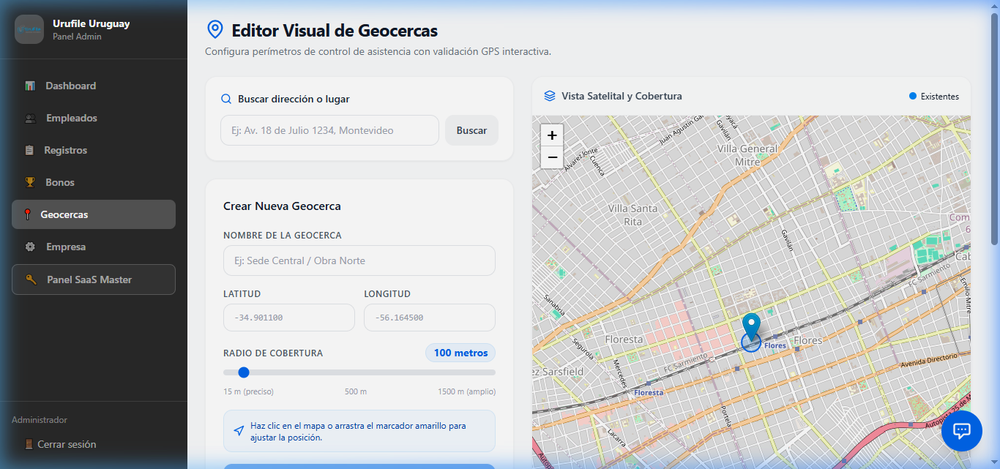
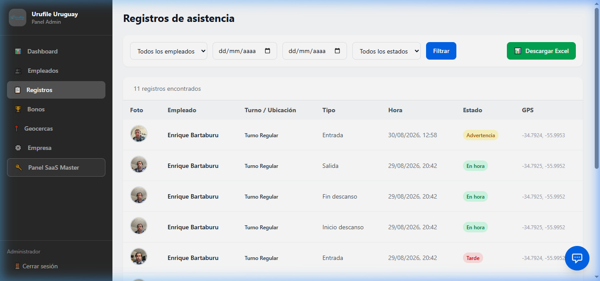

# 📘 Manual de Usuario — Control de Asistencia IA

Bienvenido al manual operativo de la plataforma de control de asistencia. Esta guía está diseñada para que administradores de personal, encargados de recursos humanos y coordinadores puedan operar el sistema de manera sencilla y eficiente.

---

## 📋 Contenido del Manual

1. [🔑 Cómo Iniciar Sesión](#1-cómo-iniciar-sesión)
2. [📊 El Panel de Control (Dashboard)](#2-el-panel-de-control-dashboard)
3. [👤 Gestión de Empleados](#3-gestión-de-empleados)
4. [⏰ Asignación de Horarios y Descansos](#4-asignación-de-horarios-y-descansos)
5. [📍 Configuración de Zonas de Marcación (Geocercas)](#5-configuración-de-zonas-de-marcación-geocercas)
6. [📅 Revisión del Historial de Asistencia](#6-revisión-del-historial-de-asistencia)
7. [👤 Registro Biométrico (Reconocimiento Facial)](#7-registro-biométrico-reconocimiento-facial)

---

## 1. 🔑 Cómo Iniciar Sesión

Para ingresar al sistema, abra su navegador web (Chrome, Firefox o Edge de preferencia) e ingrese a la dirección asignada para su empresa:

* **Dirección URL**: `https://asistencia.urufile.duckdns.org/`

En la pantalla de inicio, ingrese su correo electrónico institucional y la contraseña provista por el administrador del sistema.

> [!NOTE]
> Si está ingresando por primera vez o configurando el sistema de prueba, puede acceder utilizando las credenciales de demostración:
> * **Usuario:** `admin@miempresa.com`
> * **Contraseña:** `admin123`

---

## 2. 📊 El Panel de Control (Dashboard)

Al iniciar sesión, verá el Dashboard Principal. Este panel le brinda una vista general del estado de asistencia de su equipo en el día de hoy:

* **Métricas Principales**: Muestra el total de empleados activos, el porcentaje de puntualidad del mes, la cantidad de retrasos acumulados y la tasa de cumplimiento general.
* **Resumen del Día**: Indica a golpe de vista cuántos empleados se encuentran trabajando en este momento, cuántos están ausentes y si hay turnos pendientes de inicio.
* **Alertas Rápidas**: Detecta automáticamente anomalías o marcaciones fuera de zona geográfica permitida.

---

## 3. 👤 Gestión de Empleados

La sección **Gestión de Empleados** centraliza el padrón de personal. Desde aquí puede realizar las tareas de administración diaria:

* **Agregar Nuevo Empleado**: Haga clic en el botón azul `+ Nuevo Empleado` y complete el formulario con sus datos básicos (Nombre, Cédula de Identidad, Teléfono, Dirección, Email y Contraseña inicial).
* **Importar desde Excel/CSV**: Si tiene una plantilla con muchos empleados, use la herramienta `Importar CSV` para darlos de alta masivamente en pocos segundos.
* **Acciones Rápidas**: Al final de la fila de cada empleado encontrará botones para:
  1. 📝 Editar los datos del perfil.
  2. 📅 Configurar y ver sus horarios asignados.
  3. 📱 Desvincular su teléfono móvil (si el empleado cambia de celular y necesita registrarse en uno nuevo).
  4. 🔒 Activar/Desactivar el usuario temporalmente.

---

## 4. ⏰ Asignación de Horarios y Descansos

Al pulsar el ícono de calendario en un empleado, se abrirá el modal de **Gestión de Turnos y Descansos**. Este es uno de los pasos más importantes para garantizar el cálculo correcto de puntualidad:

1. **Seleccionar Días Laborales**: Presione los botones correspondientes a los días en que trabajará el empleado (ej. Lun, Mar, Mié, Jue, Vie).
2. **Hora de Entrada y Salida**: Defina los límites del turno de trabajo.
3. **Minutos de Tolerancia**: Establezca el margen de gracia en minutos antes de que el sistema considere el marcado como "Llegada Tarde" (ej. 5 o 10 minutos).
4. **Ubicación Requerida**: Si el empleado trabaja de forma presencial en una sucursal específica, seleccione la Geocerca correspondiente. Si trabaja desde cualquier punto o en formato remoto, elija "Todas las ubicaciones permitidas".
5. **Configuración de Descansos / Almuerzos**:
   - **Sin Descanso**: Para jornadas reducidas.
   - **Flexible**: Permite al empleado tomar su descanso de forma libre (ej. 45 minutos) a cualquier hora del día; la app móvil contará la duración del almuerzo.
   - **Horario Fijo**: Define una ventana horaria exacta en la cual se debe realizar el descanso (ej. de 13:00 a 14:00).

---

## 5. 📍 Configuración de Zonas de Marcación (Geocercas)

En el menú de **Geocercas** puede delimitar las sucursales, oficinas o predios de su empresa donde los empleados tienen autorización para fichar entrada y salida:

* **Crear Nueva Geocerca**: Puede dibujar sobre el mapa interactivo una zona circular alrededor de la coordenada exacta del establecimiento.
* **Control Geográfico Estricto**: Al asociar un horario de empleado a una geocerca, el sistema impedirá que el colaborador registre asistencia si se encuentra físicamente fuera del rango definido. Esto evita marcaciones fraudulentas desde los hogares o trayectos.

---

## 6. 📅 Revisión del Historial de Asistencia

La sección **Historial de Registros** es su bitácora digital de asistencia y auditoría:

* **Detalle por Registro**: Cada fila muestra el nombre del empleado, tipo de movimiento (Entrada, Inicio Descanso, Fin Descanso, Salida), fecha y hora exacta del marcado.
* **Filtros Inteligentes**: Busque rápidamente por rango de fechas, por nombre de empleado o por sucursal.
* **Verificación de Datos**:
  - 📍 **Mapa GPS**: Presione el botón de geolocalización para abrir el mapa y ver el punto geográfico exacto donde se presionó el botón en la app móvil.
  - 📸 **Fotografía**: Vea la imagen que el empleado se tomó al marcar para confirmar la identidad del operario.
  - 🤖 **Verificación Biométrica**: Revise el indicador de correspondencia facial de la inteligencia artificial.

---

## 7. 👤 Registro Biométrico (Reconocimiento Facial)

Para que el sistema de reconocimiento facial funcione, cada empleado debe contar con una **Foto de Referencia**:

1. En la lista de empleados, busque la columna **Biometría** y haga clic en `Registrar` (o `Verificado` si desea actualizarla).
2. Se desplegará un modal donde podrá seleccionar una fotografía frontal del empleado.
3. Asegúrese de que la foto esté bien iluminada, con el rostro despejado, sin lentes de sol ni gorros.
4. Una vez guardada, la inteligencia artificial creará un patrón biométrico que se utilizará para validar automáticamente la identidad del empleado cada vez que marque su asistencia desde su celular.
